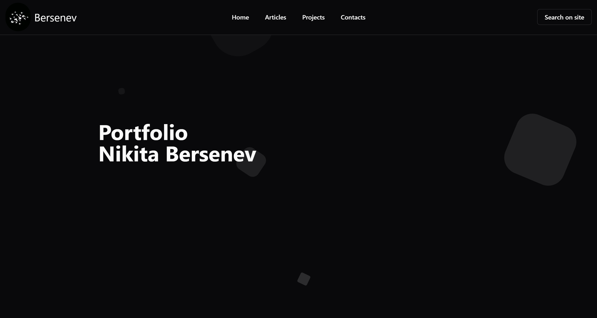

<p align="center"></p>

<h1 align="center">Yokai UI</h1>
<p align="center">
<b>Yokai UI</b> 
- small JS application using NextJS to run your own blog.
</p>

---

# Run
```bash
npm run dev
```

# Stack
- NextJS
- Shadcn

# Functionality
- site search 
- filtering by tags 
- reading articles 
- pagination
